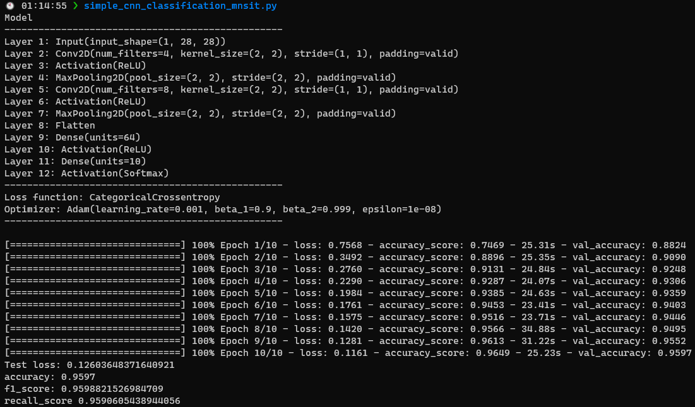

# Handmade NeuralNetwork lib

## 📝 Description

This is a handmade neural network library, made in python, **using numpy as the only dependency**.

I made it to challenge myself and to learn more about neural networks, how they work in depth.

The big part of this project was made in 4 hours and a half. The save and load features, and the binary classification support were added later.

I intend to improve the neural networks and add more features in the future.

## 📦 Features

- Many activation functions (sigmoid, tanh, relu, leaky relu, softmax, linear, elu, selu) 📈
- Many loss functions (mean squared error, mean absolute error, categorical crossentropy, binary crossentropy, huber loss) 📉
- Many optimizers (sgd, momentum, rmsprop, adam) 📊
- Supports binary classification, multiclass classification and regression 📖
- Save and load models 📁
- Simple to use 📚

## ⚙️ Installation

You can install the library using pip:

```bash
pip install neuralnetlib
```

## 💡 How to use

See [this file](examples/simple_mnist_example.py) for a simple example of how to use the library.
More examples in [this folder](examples).

You are free to tweak the hyperparameters and the network architecture to see how it affects the results.

I used the [MNIST dataset](https://en.wikipedia.org/wiki/MNIST_database) to test the library, but you can use any dataset you want.

## 📜 Output of the example file



Here is an example with Tkinter:


Here, I decided to print the first 10 predictions and their respective labels to see how the network is performing.


## ✍️ Authors

- Marc Pinet - *Initial work* - [marcpinet](https://github.com/marcpinet)