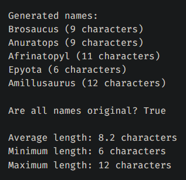
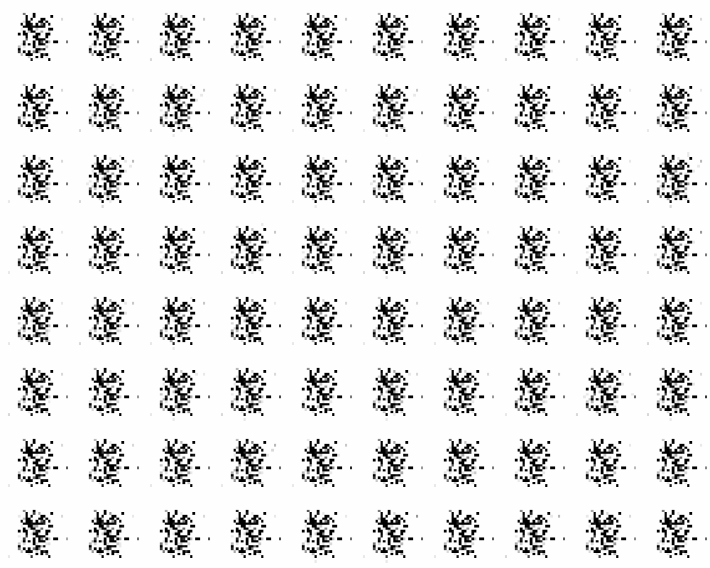

# Neuralnetlib

## 📝 Description

This is a handmade machine and deep learning framework library, made in python, **using numpy as its only external dependency**.

I made it to challenge myself and to learn more about deep neural networks, how they work _in depth_.

The big part of this project, meaning the [Multilayer Perceptron (MLP)](https://en.wikipedia.org/wiki/Multilayer_perceptron) part, was made in a week.

I then decided to push it even further by adding [Convolutional Neural Networks (CNN)](https://en.wikipedia.org/wiki/Convolutional_neural_network),  [Recurrent Neural Networks (RNN)](https://en.wikipedia.org/wiki/Recurrent_neural_network), [Autoencoders](https://en.wikipedia.org/wiki/Autoencoder), [Variational Autoencoders (VAE)](https://en.wikipedia.org/wiki/Variational_autoencoder), [GANs](https://en.wikipedia.org/wiki/Generative_adversarial_network) and [Transformers](https://en.wikipedia.org/wiki/Transformer_(machine_learning_model)).

Regarding the Transformers, I just basically reimplement the [Attention is All You Need](https://arxiv.org/abs/1706.03762) paper. It theorically works but needs a huge amount of data that can't be trained on a CPU. You can however see what each layers produce and how the attention weights are calculated [here](examples/models-usages/generation/transformer-text-generation/transformer-debug.ipynb).

This project will be maintained as long as I have ideas to improve it, and as long as I have time to work on it.

## 📦 Features

- Many models architectures (sequential, functional, autoencoder, transformer, gan) 🏗
- Many layers (dense, dropout, conv1d/2d, pooling1d/2d, flatten, embedding, batchnormalization, textvectorization, lstm, gru, attention and more) 🧠
- Many activation functions (sigmoid, tanh, relu, leaky relu, softmax, linear, elu, selu) 📈
- Many loss functions (mean squared error, mean absolute error, categorical crossentropy, binary crossentropy, huber loss) 📉
- Many optimizers (sgd, momentum, rmsprop, adam) 📊
- Supports binary classification, multiclass classification, regression and text generation 📚
- Preprocessing tools (tokenizer, pca, ngram, standardscaler, pad_sequences, one_hot_encode and more) 🛠
- Machine learning tools (isolation forest, kmeans, pca, t-sne, k-means) 🧮
- Callbacks and regularizers (early stopping, l1/l2 regularization) 📉
- Save and load models 📁
- Simple to use 📚

## ⚙️ Installation

You can install the library using pip:

```bash
pip install neuralnetlib
```

## 💡 How to use

## Basic usage

See [this file](examples/models-usages/mlp-classification-regression/mnist_multiclass.ipynb) for a simple example of how to use the library.<br>
For a more advanced example, see [this file](examples/models-usages/cnn-classification/cnn_classification_mnist.ipynb) for using CNN.<br>
You can also check [this file](examples/models-usages/mlp-classification-regression/sentiment_analysis.ipynb) for text classification using RNN.<br>

## Advanced usage

See [this file](examples/models-usages/generation/autoencoder_vae_example.ipynb) for an example of how to use VAE to generate new images.<br>
Also see [this file](examples/models-usages/generation/gan_mnist_convolutional.ipynb) for an example of how to use GAN to generate new images.<br>
And [this file](examples/models-usages/rnn-text-generation/dinosaur_names_generator.ipynb) for an example of how to generate new dinosaur names.<br>

More examples in [this folder](examples).

You are free to tweak the hyperparameters and the network architecture to see how it affects the results.

## 🚀 Quick training examples (more [here](examples/models-usages/))

### Binary Classification

```python
from neuralnetlib.models import Sequential
from neuralnetlib.layers import Input, Dense
from neuralnetlib.activations import Sigmoid
from neuralnetlib.losses import BinaryCrossentropy
from neuralnetlib.optimizers import SGD
from neuralnetlib.metrics import accuracy_score

# ... Preprocess x_train, y_train, x_test, y_test if necessary (you can use neuralnetlib.preprocess and neuralnetlib.utils)

# Create a model
model = Sequential()
model.add(Input(10))  # 10 features
model.add(Dense(8))
model.add(Dense(1))
model.add(Activation(Sigmoid()))  # many ways to tell the model which Activation Function you'd like, see the next example

# Compile the model
model.compile(loss_function='bce', optimizer='sgd')

# Train the model
model.fit(X_train, y_train, epochs=10, batch_size=32, metrics=['accuracy'])
```

### Multiclass Classification

```python
from neuralnetlib.activations import Softmax
from neuralnetlib.losses import CategoricalCrossentropy
from neuralnetlib.optimizers import Adam
from neuralnetlib.metrics import accuracy_score

# ... Preprocess x_train, y_train, x_test, y_test if necessary (you can use neuralnetlib.preprocess and neuralnetlib.utils)

# Create and compile a model
model = Sequential()
model.add(Input(28, 28, 1)) # For example, MNIST images
model.add(Conv2D(32, kernel_size=3, padding='same'), activation='relu')  # activation supports both str...
model.add(BatchNormalization())
model.add(MaxPooling2D(pool_size=2))
model.add(Dense(64, activation='relu'))
model.add(Dense(10, activation=Softmax()))  # ... and ActivationFunction objects
model.compile(loss_function='categorical_crossentropy', optimizer=Adam())


model.compile(loss_function='categorical_crossentropy', optimizer=Adam())  # same for loss_function and optimizer

# Train the model
model.fit(X_train, y_train_ohe, epochs=5, metrics=['accuracy'])
```

### Regression

```python
from neuralnetlib.losses import MeanSquaredError
from neuralnetlib.metrics import accuracy_score

# ... Preprocess x_train, y_train, x_test, y_test if necessary (you can use neuralnetlib.preprocess and neuralnetlib.utils)

# Create and compile a model
model = Sequential()
model.add(Input(13))
model.add(Dense(64, activation='leakyrelu'))
model.add(Dense(1), activation="linear")

model.compile(loss_function="mse", optimizer='adam')  # you can either put acronyms or full name

# Train the model
model.fit(X_train, y_train, epochs=100, batch_size=128, metrics=['accuracy'])
```

### Image Compression

```python
X, y = fetch_openml('Fashion-MNIST', version=1, return_X_y=True, as_frame=False)
X = X.astype('float32') / 255.

X = X.reshape(-1, 28, 28, 1)

X_train, X_test = train_test_split(X, test_size=0.2, random_state=42)

autoencoder = Autoencoder(random_state=42, skip_connections=True)

autoencoder.add_encoder_layer(Input((28, 28, 1)))
autoencoder.add_encoder_layer(Conv2D(16, kernel_size=(3, 3), strides=(2, 2), activation='relu', padding='same'))
autoencoder.add_encoder_layer(Conv2D(32, kernel_size=(3, 3), strides=(2, 2), activation='relu', padding='same'))

autoencoder.add_encoder_layer(Flatten())
autoencoder.add_encoder_layer(Dense(64, activation='relu'))  # Bottleneck

autoencoder.add_decoder_layer(Dense(7 * 7 * 32, activation='relu'))
autoencoder.add_decoder_layer(Reshape((7, 7, 32)))

autoencoder.add_decoder_layer(UpSampling2D(size=(2, 2)))  # Output: 14x14x32
autoencoder.add_decoder_layer(Conv2D(16, kernel_size=(3, 3), activation='relu', padding='same'))

autoencoder.add_decoder_layer(UpSampling2D(size=(2, 2)))  # Output: 28x28x16
autoencoder.add_decoder_layer(Conv2D(1, kernel_size=(3, 3), activation='sigmoid', padding='same'))  # Output: 28x28x1

autoencoder.compile(encoder_loss='mse', decoder_loss='mse', encoder_optimizer='adam', decoder_optimizer='adam', verbose=True)

history = autoencoder.fit(X_train, epochs=5, batch_size=256, validation_data=(X_test,), verbose=True,)
```

### Image Generation

```python
# Load the MNIST dataset
(x_train, y_train), (x_test, y_test) = mnist.load_data()
n_classes = np.unique(y_train).shape[0]

# Concatenate train and test data
X = np.concatenate([x_train, x_test])
y = np.concatenate([y_train, y_test])

# Flatten images
X = X.reshape(X.shape[0], -1)

# Normalize pixel values
X = X.astype('float32') / 255

# Labels to categorical 
y = one_hot_encode(y, n_classes)

noise_dim = 32

generator = Sequential()
generator.add(Input(noise_dim))
generator.add(Dense(128, input_dim=noise_dim + n_classes, activation='leakyrelu'))
generator.add(Dense(784, activation='sigmoid'))

discriminator = Sequential()
discriminator.add(Input(784 + n_classes))
discriminator.add(Dense(128, input_dim=784 + n_classes, activation='leakyrelu'))
discriminator.add(Dense(1, activation='sigmoid'))

gan = GAN(latent_dim=noise_dim, n_classes=n_classes)

gan.compile(generator, discriminator, generator_optimizer='adam', discriminator_optimizer='adam', loss_function='bce', verbose=True)

history = gan.fit(X, y, epochs=40, batch_size=128, plot_generated=True)   
```

### Text Generation (example here is for translation)

```python
df = pd.read_csv("dataset.tsv", sep="\t")
df.iloc[:, 1] = df.iloc[:, 1].apply(lambda x: re.sub(r'\\x[a-fA-F0-9]{2}|\\u[a-fA-F0-9]{4}|\xa0|\u202f', ' ', x))  # remove unicode characters

LIMIT = 1000
fr_sentences = df.iloc[:, 1].values.tolist()[0:LIMIT]
en_sentences = df.iloc[:, 3].values.tolist()[0:LIMIT]

fr_tokenizer = Tokenizer(filters="", mode="word")  # else the tokenizer would remove the special characters including ponctuation
en_tokenizer = Tokenizer(filters="", mode="word")  # else the tokenizer would remove the special characters including ponctuation

fr_tokenizer.fit_on_texts(fr_sentences, preprocess_ponctuation=True)
en_tokenizer.fit_on_texts(en_sentences, preprocess_ponctuation=True)

X = fr_tokenizer.texts_to_sequences(fr_sentences, preprocess_ponctuation=True, add_special_tokens=True)
y = en_tokenizer.texts_to_sequences(en_sentences, preprocess_ponctuation=True, add_special_tokens=True)

max_len_x = max(len(seq) for seq in X)
max_len_y = max(len(seq) for seq in y)
max_seq_len = max(max_len_x, max_len_y)

vocab_size_fr = len(fr_tokenizer.word_index)
vocab_size_en = len(en_tokenizer.word_index)
max_vocab_size = max(vocab_size_fr, vocab_size_en)

X = pad_sequences(X, max_length=max_seq_len, padding='post', pad_value=fr_tokenizer.PAD_IDX)
y = pad_sequences(y, max_length=max_seq_len, padding='post', pad_value=en_tokenizer.PAD_IDX)

x_train, x_test, y_train, y_test = train_test_split(X, y, test_size=0.2, shuffle=False)

model = Transformer(src_vocab_size=vocab_size_fr, tgt_vocab_size=vocab_size_en, d_model=512, n_heads=8, n_encoder_layers=8, n_decoder_layers=10, d_ff=2048, dropout_rate=0.1, max_sequence_length=max_seq_len, random_state=42)

model.compile(loss_function="cels", optimizer=Adam(learning_rate=5e-5, beta_1=0.9, beta_2=0.98, epsilon=1e-9, clip_norm=1.0, ), verbose=True)

history = model.fit(x_train, y_train, epochs=50, batch_size=32, verbose=True, callbacks=[EarlyStopping(monitor='loss', patience=20), LearningRateScheduler(schedule="warmup_cosine", initial_learning_rate=5e-5, verbose=True)],validation_data=(x_test, y_test), metrics=['bleu_score'])
```

> [!NOTE]
> You can also save and load models using the `save` and `load` methods.

```python
# Save a model
model.save('my_model.json')

# Load a model
model = Model.load('my_model.json')
```

## 📜 Some outputs and easy usages

### Here is the decision boundary on a Binary Classification (breast cancer dataset):


> [!NOTE]
> PCA (Principal Component Analysis) was used to reduce the number of features to 2, so we could plot the decision boundary.
> Representing n-dimensional data in 2D is not easy, so the decision boundary may not be *always* accurate.
> I also tried with t-SNE, but the results were not good.

### Here is an example of a model training on the mnist using the library


### Here is an example of a loaded model used with Tkinter:


### Here, I replaced Keras/Tensorflow with this library for my [Handigits](https://github.com/marcpinet/handigits) project...


### Here is the generated dinosaur names using a simple RNN and a list of existing dinosaur names.



### Here are some MNIST generated images using a cGAN.



**You can __of course__ use the library for any dataset you want.**

## ✏️ Edit the library

You can pull the repository and run:

```bash
pip install -e .
```

And test your changes on the examples.

## 🎯 TODO

- [ ] Add support for stream dataset loading to allow loading large datasets (larger than your RAM)
- [ ] Visual updates (tabulation of model.summary() parameters calculation, colorized progress bar, etc.)
- [ ] Better save format (like h5py)
- [ ] Add cuDNN support to allow the use of GPUs

## 🐞 Know issues

Nothing yet! Feel free to open an issue if you find one.

## ✍️ Authors

- Marc Pinet - *Initial work* - [marcpinet](https://github.com/marcpinet)
